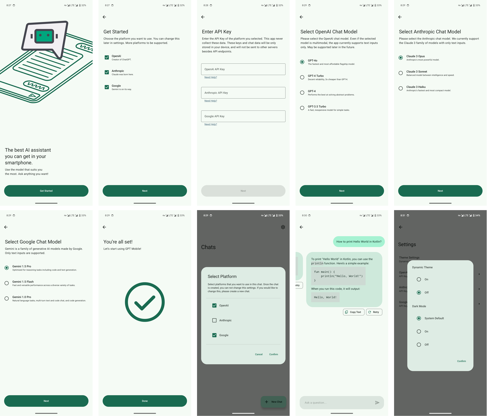

# GPT Mobile

### Chat Assistant for Android that supports chatting with multiple models at once.

## Screenshots

## Features

- Chat with multiple models at once
  - Uses official APIs for each platforms
  - Supported platforms:
    - OpenAI GPT
    - Anthropic Claude
    - Google Gemini
- Local chat history
  - Chat history is only saved locally
  - Only sends to official API servers while chatting
- [Material You](https://m3.material.io/) style UI
  - Supports dark mode, system dynamic theming **without Activity restart**
- Per app language setting for Android 13+
- 100% Kotlin, Jetpack Compose, Single Activity, [Modern App Architecture](https://developer.android.com/topic/architecture#modern-app-architecture) in Android developers documentation

## To be supported

- Manual Languages Setting for Android 12 and below
- More platforms
- Image, file support for multimodal models

If you have any feature requests, please open an issue.

## Downloads

Download the latest APK from the [releases page](https://github.com/Taewan-P/releases)

## Build

1. Clone repo
2. Open in Android Studio
3. Click `Run` or do Gradle build

## License

See [LICENSE](./LICENSE) for details.
